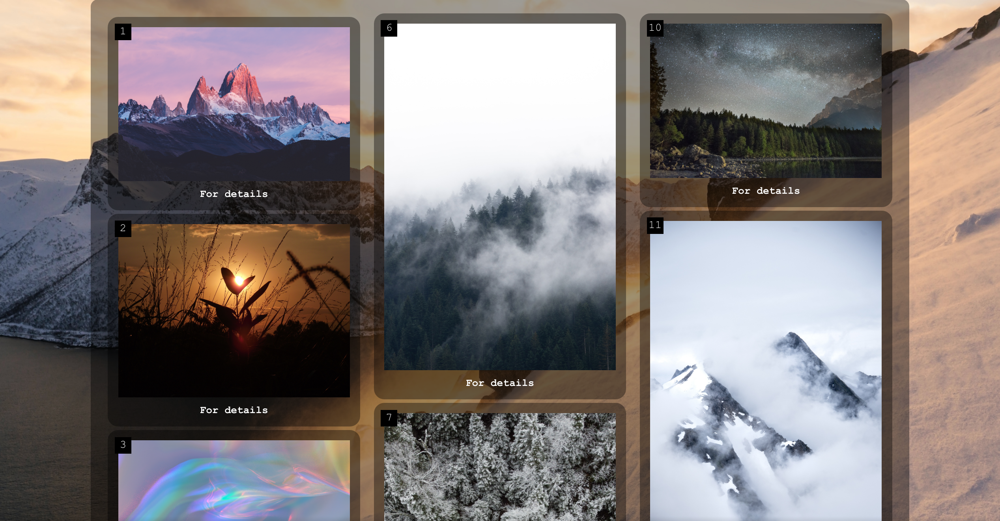
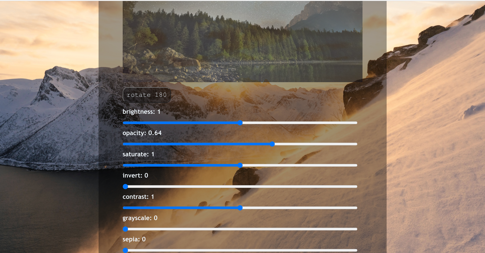
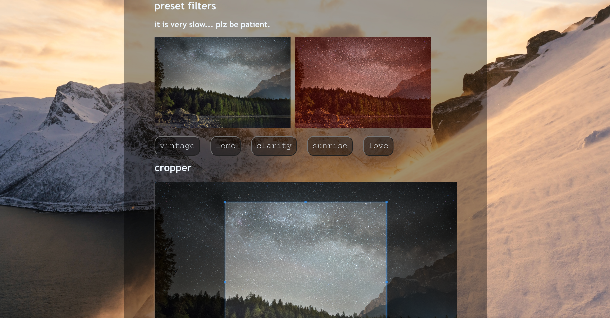

# web 第四次作业

191250045 侯为栋.

本次作业实现了:

- 手动属性调整
- 图片旋转
- 图片风格转换 ( preset )
- 图片缩放裁剪, 并展示

## usage

运行以下命令生成静态文件:

```shell
make clean
make
```

而后在服务器中运行, 最方便的方式是 vscode 的 LiveServer 插件.

**注意**: 以 make 命令生成的 **index.html 所在文件夹**为**根目录路径**!

因为 index.html 中展示的图片路径是 ../img/gallary/, 如果 index.html 不在根目录就找不到图片.

~~其实可以改, 但是...~~

可以在 img/gallary 图片下放置自己的图片, 而后重新运行上述两条命令, 即可显示新的图片.

具体请看 Makefile 文件.

## 实现方式

### 手动属性调整

主要通过操纵 css 的 filter 属性实现.

以 range 型的 input 输入为参数动态更改 filter 属性即可.

具体请见 js/common.js.

### 图片旋转

在 css/rotate.css 中提前定义好两种 transform 角度, 而后动态更改类名即可.

具体请见 css/rotate.css 和 js/rotate.js.

### 图片风格转换

使用 CamanJS 库.

在点击风格选项时调用 Caman 对应的 api 接口, 例如:

```js
Caman("#canvas", "**.jpg", function() {
  this.vintage();
  this.render();
});
```

具体请见每个子页面对应的 script.

### 图片裁剪

使用 cropper.js 库.

增加一个 crop 按钮, 在点击的时候就生成一个 img 并将其加入结果 div 中.

具体请见 js/crop.js.

## 运行截图

主页显示图片瀑布:



点击 For Details 进入子页面.

手动拖动属性条修改图片并预览, 或旋转图片:



选择预设选项修改图片风格, 注意这个功能非常慢:



对图片进行缩放裁剪, 点击 crop 预览裁剪图片:


