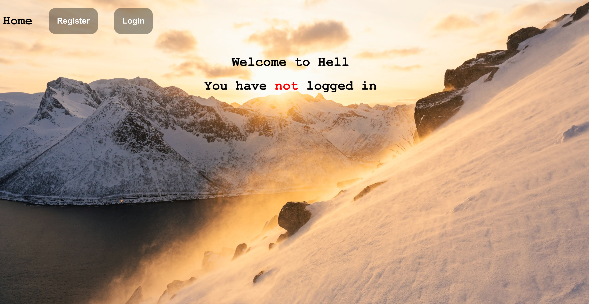
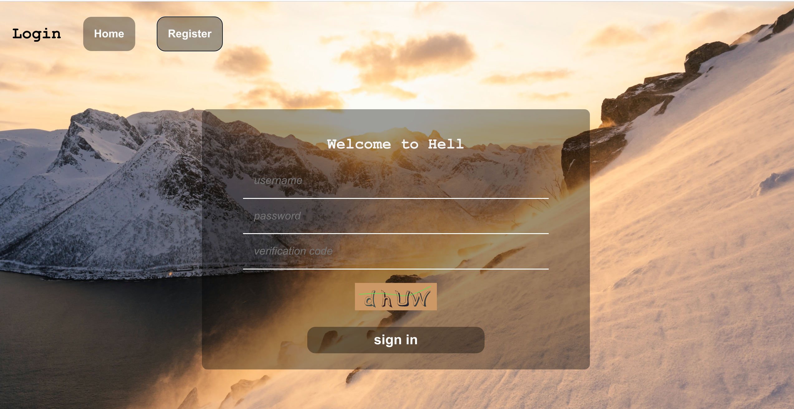
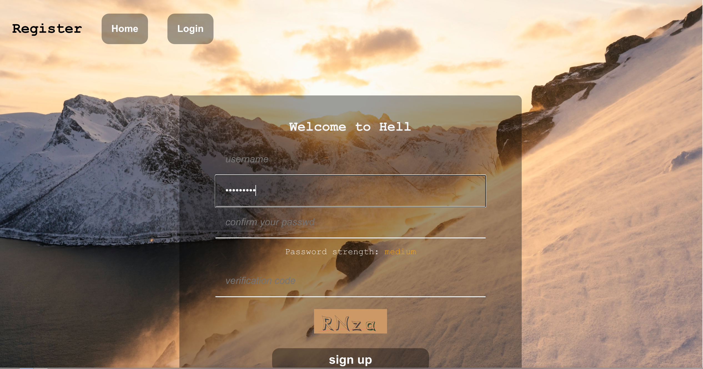
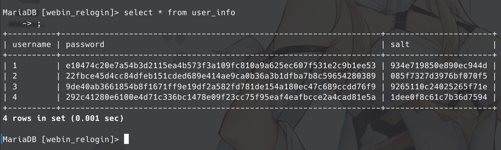

# web 第三次作业报告

191250045 侯为栋.

- [web 第三次作业报告](#web-第三次作业报告)
  - [环境配置](#环境配置)
  - [前端实现](#前端实现)
  - [后端实现](#后端实现)
    - [密码验证](#密码验证)
    - [验证码](#验证码)
  - [运行截图](#运行截图)

## 环境配置

数据库使用 mysql, 相关配置在 server/src/config.js, 请在此文件内填上自己的数据库信息.

数据库 schema 和一些样例数据在 server/sql/data.sql 中.

本项目为前后端分离项目, 使用 Restful Api 进行连接, 故前后端需要分别运行.

前端, 进入 client 目录后执行:

```shell
yarn install
yarn start
```

成功后打开 `http://localhost:3000` 即可.

如果没有 yarn 请自行安装, STFW, 很简单的.

后端, 进入 server 目录后执行:

```shell
npm install
npm start
```

命令执行过后后端会跑在 `http://localhost:8000`.

## 前端实现

前端采用 create-react-app 脚本创建, api 采用 axios 方案.

项目结构如下:

```text
.
├── package.json
├── public
│   ├── index.html // 挂载点
│   ├── manifest.json
│   └── robots.txt
├── README.md
├── src
│   ├── apis
│   │   ├── config.js // api 配置, axios 模块
│   │   └── user.js // user 相关 api
│   ├── app.js // App 组件, 负责渲染主页面
│   ├── assets
│   │   ├── app.css // 全局有效的 css
│   │   └── daniel-mirlea-WGdliLPgMaA-unsplash.jpg // 背景图片
│   ├── components
│   │   ├── login.js // Login 组件
│   │   └── register.js // Register 组件
│   ├── index.js // 主要调用逻辑
│   └── utils
│       ├── constant.js // 全局常量
│       ├── hoc.js // 高阶组件, Login 和 Register 是由它构造的
│       └── password.js // 密码强度验证
└── yarn.lock
```

## 后端实现

后端为 express + mysql, 项目结构如下:

```text
.
├── app.js // 主要调用逻辑
├── package.json
├── package-lock.json
├── sql
│   └── data.sql // 数据库 schema
└── src
    ├── api
    │   └── user.js // user 相关 service
    ├── config.js // 配置文件
    ├── data
    │   ├── db.js // 数据库连接
    │   └── user.js // user 相关 data-service
    └── util
        ├── constant.js // 全局常量
        └── crypt.js // 加密解密
```

### 密码验证

使用 node 内建库 crypto.

在注册时将密码明文通过加盐 sha256 加密并保存, 在登录时再次加密明文并和数据库中比对即可:

```js
// login
const pwd = encrypt(req.body.password, cur.salt);
if (cur.password !== pwd) {
  // ...
}

// register
// salt 随机生成
const salt = randomStr(20);
const pwd = encrypt(req.body.password, salt);
addUser(req.body.username, pwd, salt);

// encrypt
export function encrypt(str, salt) {
  return crypto.createHmac("sha256", salt).update(str).digest("hex");
}
```

### 验证码

采用第三方库 svg-captcha.

通过它的 api 可以得到验证码的图片 ( svg ) 和 对应文本, 将 svg 作为 innerHTML 插入并将文本作为答案即可.

验证码的查验过程在后端. 通过对称加密的方式将文本加密送往前端, 而后得到用户输入后和之前的加密文本一起传回, 此时对之前的加密文本进行解密再和用户输入比对即可.

## 运行截图

界面截图:

未登录主页:



登录页面:



注册页面:



登录后主页:


数据表截图:


