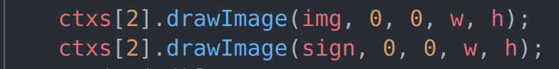

# watermark

191250045 侯为栋.

网页太长了不方便截图, 助教/老师自行运行查看即可.

record.mkv 是运行录屏, 可看可不看.

## usage

在静态网站服务器上打开 index.html 即可.

不可直接在浏览器中打开, 会出现跨域问题.

会搭建静态网页服务器吗?

如果不会, 在根目录中运行:

```shell
npm install http-server
npx http-server -a 127.0.0.1 -p 5500
```

然后直接访问 127.0.0.1:5500.

或者在 vscode 中装 Live Server 这个插件.

## method

使用 canvas 画布进行操作.

可见水印就是先画上原图再画上水印:



数字水印就是先画上原图, 在根据水印的数据来调整原图的像素点的最后一位.

RGB 三个通道都可以用来调整, 我选择 R 通道:


具体可看注释. 觉得字小的话可以看源码.

提取水印的过程就是反其道而行之, 即遇到末位为 1 的就认为这是信息点, 否则就忽略.

具体代码如下, 因较简单故未加注释:


